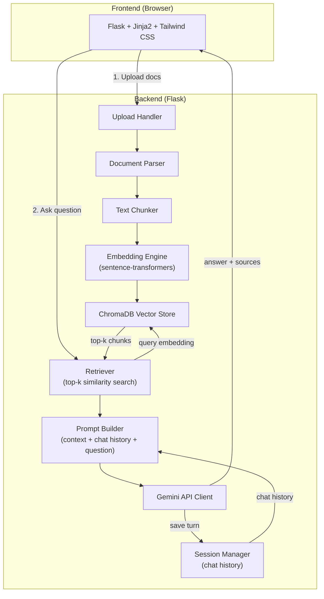
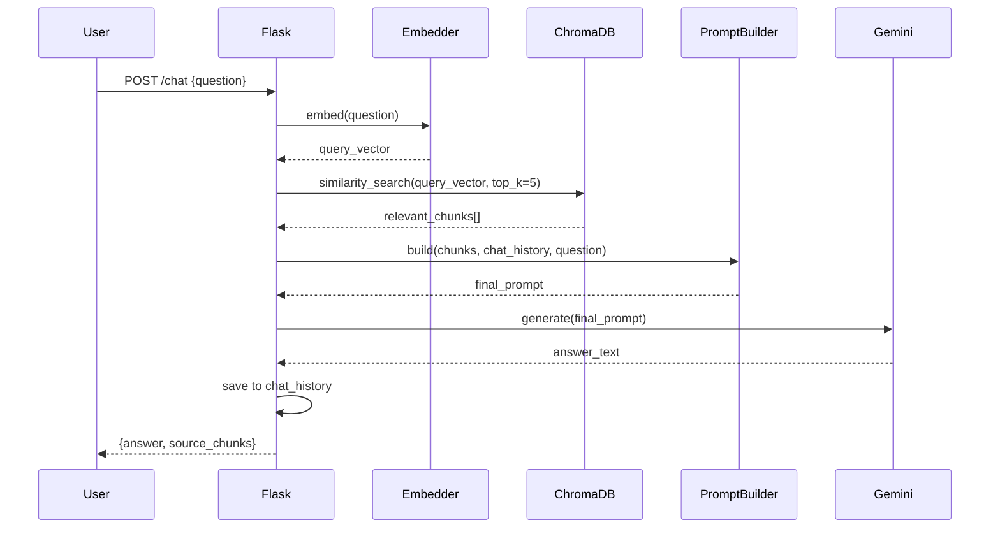

# DocChat — Implementation Plan

## Goal Description

Build **DocChat**, a portfolio-quality RAG (Retrieval-Augmented Generation) Document Q&A web application. Users upload documents (PDF, TXT, MD, DOCX, etc.), ask natural-language questions, and receive LLM-generated answers grounded in the uploaded content — with cited source chunks and conversational follow-up support.

### Tech Stack Summary

| Layer | Choice | Rationale |
|---|---|---|
| LLM | Gemini (Google AI API) | User preference |
| Embeddings | `sentence-transformers` (local) | Free, no API costs during dev |
| Vector Store | ChromaDB | Simple API, built-in persistence |
| Web Framework | Flask | User has experience, more control |
| Frontend | Jinja2 + Tailwind CSS | Clean portfolio-quality UI |
| Document Parsing | PyMuPDF, python-docx, python-pptx, etc. | Multi-format support |

---

## Architecture Overview



### RAG Pipeline Flow (per question)



---

## User Review Required

> [!IMPORTANT]
> **Gemini API Key**: You'll need a Google AI API key. Get one free at [Google AI Studio](https://aistudio.google.com/apikey). The app will read it from a `.env` file — your key never goes into code.

> [!IMPORTANT]
> **First-run model download**: The embedding model (`all-MiniLM-L6-v2`, ~80 MB) will be downloaded automatically on first run. This is a one-time cost.

> [!WARNING]
> **Scanned/image PDFs**: This v1 will **not** support OCR for scanned PDFs (image-only pages). Only text-extractable PDFs will work. OCR support (via Tesseract) can be added as a v2 feature.

---

## Open Questions

> [!IMPORTANT]
> **Question 1**: Do you want dark mode, light mode, or a toggle? I'm planning a clean modern chat UI with Tailwind — I'll default to **dark mode with a toggle** unless you say otherwise.

> [!IMPORTANT]
> **Question 2**: Should there be a sidebar showing uploaded documents with the ability to delete individual ones, or just a simple upload area at the top?

---

## Proposed Changes

### Project Structure

```
Doc Chat/
├── doc/                          # (existing) Project docs
├── app/
│   ├── __init__.py               # Flask app factory
│   ├── config.py                 # Configuration (env vars, model settings)
│   ├── routes/
│   │   ├── __init__.py
│   │   ├── main.py               # Main page route
│   │   ├── upload.py             # Document upload endpoints
│   │   └── chat.py               # Chat/Q&A endpoints
│   ├── services/
│   │   ├── __init__.py
│   │   ├── parser.py             # Document parsing (PDF, DOCX, TXT, MD, etc.)
│   │   ├── chunker.py            # Text chunking with overlap
│   │   ├── embedder.py           # Embedding generation (sentence-transformers)
│   │   ├── vectorstore.py        # ChromaDB operations
│   │   ├── retriever.py          # Similarity search & retrieval
│   │   ├── llm.py                # Gemini API client
│   │   └── chat_session.py       # Chat history / session management
│   ├── templates/
│   │   ├── base.html             # Base template with Tailwind
│   │   ├── index.html            # Main chat page
│   │   └── components/
│   │       ├── chat_message.html # Chat bubble component
│   │       ├── source_card.html  # Source chunk citation card
│   │       ├── upload_area.html  # Document upload dropzone
│   │       └── sidebar.html      # Document list sidebar
│   ├── static/
│   │   ├── css/
│   │   │   └── styles.css        # Custom styles
│   │   └── js/
│   │       └── chat.js           # Chat interaction JS (AJAX, scroll, etc.)
│   └── uploads/                  # Uploaded files (gitignored)
├── tests/
│   ├── __init__.py
│   ├── test_parser.py
│   ├── test_chunker.py
│   ├── test_retriever.py
│   └── test_chat.py
├── .env.example                  # Template for environment variables
├── .gitignore
├── requirements.txt
├── run.py                        # Entry point
└── README.md                     # Portfolio-quality README
```

---

### Component 1: Configuration & Project Setup

#### [NEW] `requirements.txt`

```txt
# Web framework
flask==3.1.1
python-dotenv==1.1.0

# Document parsing
PyMuPDF==1.25.5           # PDF text extraction
python-docx==1.1.2        # DOCX parsing
python-pptx==1.0.2        # PPTX parsing (bonus)
openpyxl==3.1.5           # XLSX parsing (bonus)

# RAG pipeline
sentence-transformers==4.1.0   # Local embeddings
chromadb==1.0.3                # Vector store

# LLM
google-genai==1.20.0           # Gemini API

# Utilities
werkzeug==3.1.3
```

#### [NEW] `.env.example`

```env
GEMINI_API_KEY=your_api_key_here
EMBEDDING_MODEL=all-MiniLM-L6-v2
CHROMA_PERSIST_DIR=./chroma_db
UPLOAD_FOLDER=./app/uploads
CHUNK_SIZE=500
CHUNK_OVERLAP=50
TOP_K=5
FLASK_SECRET_KEY=change-me-to-a-random-string
```

#### [NEW] `app/config.py`

```python
import os
from dotenv import load_dotenv

load_dotenv()

class Config:
    SECRET_KEY = os.getenv("FLASK_SECRET_KEY", "dev-secret-key")
    GEMINI_API_KEY = os.getenv("GEMINI_API_KEY")
    EMBEDDING_MODEL = os.getenv("EMBEDDING_MODEL", "all-MiniLM-L6-v2")
    CHROMA_PERSIST_DIR = os.getenv("CHROMA_PERSIST_DIR", "./chroma_db")
    UPLOAD_FOLDER = os.getenv("UPLOAD_FOLDER", "./app/uploads")
    CHUNK_SIZE = int(os.getenv("CHUNK_SIZE", "500"))
    CHUNK_OVERLAP = int(os.getenv("CHUNK_OVERLAP", "50"))
    TOP_K = int(os.getenv("TOP_K", "5"))
    MAX_CONTENT_LENGTH = 50 * 1024 * 1024  # 50MB max upload
    ALLOWED_EXTENSIONS = {"pdf", "txt", "md", "docx", "pptx", "xlsx"}
```

---

### Component 2: Document Parser

#### [NEW] `app/services/parser.py`

Handles multi-format document ingestion. Each parser returns a list of `(text, metadata)` tuples where metadata includes source filename and page/section info.

```python
"""Multi-format document parser.

Supported formats: PDF, TXT, MD, DOCX, PPTX, XLSX
Each parser returns: list[dict] with keys 'text', 'source', 'page'
"""

import fitz  # PyMuPDF
from docx import Document as DocxDocument
from pptx import Presentation
from openpyxl import load_workbook
from pathlib import Path


def parse_document(filepath: str) -> list[dict]:
    """Route to the correct parser based on file extension."""
    ext = Path(filepath).suffix.lower()
    parsers = {
        ".pdf": _parse_pdf,
        ".txt": _parse_text,
        ".md": _parse_text,
        ".docx": _parse_docx,
        ".pptx": _parse_pptx,
        ".xlsx": _parse_xlsx,
    }
    parser = parsers.get(ext)
    if not parser:
        raise ValueError(f"Unsupported file type: {ext}")
    return parser(filepath)


def _parse_pdf(filepath: str) -> list[dict]:
    """Extract text from each page of a PDF."""
    pages = []
    with fitz.open(filepath) as doc:
        for i, page in enumerate(doc):
            text = page.get_text()
            if text.strip():
                pages.append({
                    "text": text,
                    "source": Path(filepath).name,
                    "page": i + 1
                })
    return pages


def _parse_text(filepath: str) -> list[dict]:
    """Read plain text / markdown files."""
    text = Path(filepath).read_text(encoding="utf-8")
    return [{"text": text, "source": Path(filepath).name, "page": 1}]


def _parse_docx(filepath: str) -> list[dict]:
    """Extract text from Word documents, paragraph by paragraph."""
    doc = DocxDocument(filepath)
    full_text = "\n".join(p.text for p in doc.paragraphs if p.text.strip())
    return [{"text": full_text, "source": Path(filepath).name, "page": 1}]


def _parse_pptx(filepath: str) -> list[dict]:
    """Extract text from PowerPoint slides."""
    prs = Presentation(filepath)
    slides = []
    for i, slide in enumerate(prs.slides):
        texts = []
        for shape in slide.shapes:
            if shape.has_text_frame:
                texts.append(shape.text_frame.text)
        if texts:
            slides.append({
                "text": "\n".join(texts),
                "source": Path(filepath).name,
                "page": i + 1
            })
    return slides


def _parse_xlsx(filepath: str) -> list[dict]:
    """Extract text from Excel spreadsheets, sheet by sheet."""
    wb = load_workbook(filepath, read_only=True)
    sheets = []
    for sheet_name in wb.sheetnames:
        ws = wb[sheet_name]
        rows = []
        for row in ws.iter_rows(values_only=True):
            row_text = " | ".join(str(cell) for cell in row if cell is not None)
            if row_text.strip():
                rows.append(row_text)
        if rows:
            sheets.append({
                "text": "\n".join(rows),
                "source": f"{Path(filepath).name} [{sheet_name}]",
                "page": 1
            })
    return sheets
```

---

### Component 3: Text Chunker

#### [NEW] `app/services/chunker.py`

Splits extracted text into overlapping chunks for embedding. Uses character-based chunking with sentence-boundary awareness.

```python
"""Text chunker with configurable size and overlap.

Splits text into chunks that respect sentence boundaries where possible,
with overlap to preserve context across chunk boundaries.
"""


def chunk_text(
    text: str,
    chunk_size: int = 500,
    chunk_overlap: int = 50
) -> list[str]:
    """Split text into overlapping chunks.

    Args:
        text: The input text to chunk.
        chunk_size: Target size of each chunk in characters.
        chunk_overlap: Number of overlapping characters between chunks.

    Returns:
        List of text chunks.
    """
    if len(text) <= chunk_size:
        return [text.strip()] if text.strip() else []

    chunks = []
    start = 0
    while start < len(text):
        end = start + chunk_size

        # Try to break at a sentence boundary
        if end < len(text):
            # Look for sentence-ending punctuation near the end
            for sep in [". ", ".\n", "? ", "!\n", "\n\n"]:
                last_sep = text.rfind(sep, start + chunk_size // 2, end)
                if last_sep != -1:
                    end = last_sep + len(sep)
                    break

        chunk = text[start:end].strip()
        if chunk:
            chunks.append(chunk)

        start = end - chunk_overlap

    return chunks


def chunk_documents(
    pages: list[dict],
    chunk_size: int = 500,
    chunk_overlap: int = 50
) -> list[dict]:
    """Chunk parsed document pages, preserving metadata.

    Args:
        pages: Output from parser.parse_document().
        chunk_size: Target chunk size.
        chunk_overlap: Overlap between chunks.

    Returns:
        List of dicts with 'text', 'source', 'page', 'chunk_index' keys.
    """
    all_chunks = []
    for page in pages:
        text_chunks = chunk_text(page["text"], chunk_size, chunk_overlap)
        for i, chunk in enumerate(text_chunks):
            all_chunks.append({
                "text": chunk,
                "source": page["source"],
                "page": page["page"],
                "chunk_index": i,
            })
    return all_chunks
```

---

### Component 4: Embedding Engine

#### [NEW] `app/services/embedder.py`

Wraps `sentence-transformers` for generating embeddings from text chunks and queries.

```python
"""Embedding engine using sentence-transformers.

Loads the model once and provides methods to embed
documents (batches) and queries (single strings).
"""

from sentence_transformers import SentenceTransformer


class Embedder:
    """Manages the embedding model lifecycle."""

    def __init__(self, model_name: str = "all-MiniLM-L6-v2"):
        self.model = SentenceTransformer(model_name)

    def embed_documents(self, texts: list[str]) -> list[list[float]]:
        """Embed a batch of document chunks."""
        embeddings = self.model.encode(texts, show_progress_bar=True)
        return embeddings.tolist()

    def embed_query(self, text: str) -> list[float]:
        """Embed a single query string."""
        embedding = self.model.encode(text)
        return embedding.tolist()
```

---

### Component 5: Vector Store (ChromaDB)

#### [NEW] `app/services/vectorstore.py`

Manages ChromaDB collection — adding document chunks with metadata and performing similarity search.

```python
"""ChromaDB vector store wrapper.

Handles collection creation, document insertion,
and similarity search with metadata filtering.
"""

import chromadb
from chromadb.config import Settings


class VectorStore:
    """ChromaDB-backed vector store for document chunks."""

    def __init__(self, persist_dir: str = "./chroma_db"):
        self.client = chromadb.PersistentClient(path=persist_dir)
        self.collection = self.client.get_or_create_collection(
            name="doc_chat",
            metadata={"hnsw:space": "cosine"}
        )

    def add_documents(
        self,
        chunks: list[dict],
        embeddings: list[list[float]]
    ) -> None:
        """Add document chunks with their embeddings to the store."""
        ids = [
            f"{chunk['source']}_p{chunk['page']}_c{chunk['chunk_index']}"
            for chunk in chunks
        ]
        documents = [chunk["text"] for chunk in chunks]
        metadatas = [
            {"source": chunk["source"], "page": chunk["page"]}
            for chunk in chunks
        ]

        self.collection.add(
            ids=ids,
            documents=documents,
            embeddings=embeddings,
            metadatas=metadatas,
        )

    def search(
        self,
        query_embedding: list[float],
        top_k: int = 5
    ) -> list[dict]:
        """Find the top-k most similar chunks to the query."""
        results = self.collection.query(
            query_embeddings=[query_embedding],
            n_results=top_k,
            include=["documents", "metadatas", "distances"],
        )

        hits = []
        for i in range(len(results["ids"][0])):
            hits.append({
                "text": results["documents"][0][i],
                "source": results["metadatas"][0][i]["source"],
                "page": results["metadatas"][0][i]["page"],
                "score": 1 - results["distances"][0][i],  # cosine similarity
            })
        return hits

    def delete_by_source(self, source_name: str) -> None:
        """Delete all chunks from a specific source document."""
        self.collection.delete(
            where={"source": source_name}
        )

    def get_sources(self) -> list[str]:
        """Get a list of all unique source document names."""
        results = self.collection.get(include=["metadatas"])
        sources = set()
        for meta in results["metadatas"]:
            sources.add(meta["source"])
        return sorted(sources)

    def clear(self) -> None:
        """Remove all documents from the collection."""
        self.client.delete_collection("doc_chat")
        self.collection = self.client.get_or_create_collection(
            name="doc_chat",
            metadata={"hnsw:space": "cosine"}
        )
```

---

### Component 6: Retriever

#### [NEW] `app/services/retriever.py`

Orchestrates the retrieval step — embeds the query, searches the vector store, and returns relevant chunks.

```python
"""Retriever — connects embedder and vector store for search."""

from app.services.embedder import Embedder
from app.services.vectorstore import VectorStore


class Retriever:
    """Retrieves relevant document chunks for a given query."""

    def __init__(self, embedder: Embedder, vectorstore: VectorStore, top_k: int = 5):
        self.embedder = embedder
        self.vectorstore = vectorstore
        self.top_k = top_k

    def retrieve(self, query: str) -> list[dict]:
        """Find the most relevant chunks for a question."""
        query_embedding = self.embedder.embed_query(query)
        results = self.vectorstore.search(query_embedding, top_k=self.top_k)
        return results
```

---

### Component 7: Gemini LLM Client

#### [NEW] `app/services/llm.py`

Handles prompt construction and Gemini API calls. Includes the system prompt that instructs the model to answer only from provided context and cite sources.

```python
"""Gemini LLM client with RAG-aware prompt construction."""

from google import genai


class GeminiClient:
    """Wrapper for Gemini API with RAG prompt building."""

    SYSTEM_PROMPT = """You are DocChat, a helpful document Q&A assistant.
You answer questions ONLY based on the provided document context.

Rules:
1. If the answer is found in the context, provide a clear, accurate answer.
2. If the answer is NOT in the context, say: "I couldn't find information about that in the uploaded documents."
3. Always reference which source document and page the information came from.
4. Be concise but thorough.
5. If the user asks a follow-up question, use the chat history for context."""

    def __init__(self, api_key: str):
        self.client = genai.Client(api_key=api_key)

    def generate_answer(
        self,
        question: str,
        context_chunks: list[dict],
        chat_history: list[dict] | None = None,
    ) -> str:
        """Generate an answer using retrieved context and chat history."""
        # Build context section
        context_parts = []
        for i, chunk in enumerate(context_chunks, 1):
            context_parts.append(
                f"[Source {i}: {chunk['source']}, Page {chunk['page']}]\n"
                f"{chunk['text']}"
            )
        context_text = "\n\n---\n\n".join(context_parts)

        # Build chat history section
        history_text = ""
        if chat_history:
            history_parts = []
            for turn in chat_history[-5:]:  # Last 5 turns for context window
                history_parts.append(f"User: {turn['question']}")
                history_parts.append(f"Assistant: {turn['answer']}")
            history_text = "\n".join(history_parts)

        # Compose the full prompt
        user_prompt = f"""## Document Context
{context_text}

## Chat History
{history_text if history_text else "(No previous conversation)"}

## Current Question
{question}

Provide a helpful answer based on the document context above. Cite sources using [Source N] notation."""

        response = self.client.models.generate_content(
            model="gemini-2.5-flash",
            contents=[
                {"role": "user", "parts": [{"text": self.SYSTEM_PROMPT}]},
                {"role": "model", "parts": [{"text": "Understood. I'll answer questions based only on the provided document context and cite my sources."}]},
                {"role": "user", "parts": [{"text": user_prompt}]},
            ],
        )
        return response.text
```

---

### Component 8: Chat Session Manager

#### [NEW] `app/services/chat_session.py`

Manages in-memory chat history per session. Each session tracks the conversation turns with question, answer, and sources.

```python
"""In-memory chat session manager.

Tracks conversation history per session for follow-up support.
"""


class ChatSession:
    """Manages chat history for a single user session."""

    def __init__(self):
        self.history: list[dict] = []

    def add_turn(self, question: str, answer: str, sources: list[dict]) -> None:
        """Record a Q&A turn."""
        self.history.append({
            "question": question,
            "answer": answer,
            "sources": sources,
        })

    def get_history(self) -> list[dict]:
        """Return the full chat history."""
        return self.history

    def clear(self) -> None:
        """Clear the chat history."""
        self.history.clear()


class SessionManager:
    """Manages multiple chat sessions (keyed by session ID)."""

    def __init__(self):
        self._sessions: dict[str, ChatSession] = {}

    def get_session(self, session_id: str) -> ChatSession:
        """Get or create a session."""
        if session_id not in self._sessions:
            self._sessions[session_id] = ChatSession()
        return self._sessions[session_id]

    def delete_session(self, session_id: str) -> None:
        """Delete a session."""
        self._sessions.pop(session_id, None)
```

---

### Component 9: Flask Application & Routes

#### [NEW] `app/__init__.py`

Flask app factory that initializes all services as singletons.

```python
"""Flask application factory."""

import os
from flask import Flask
from app.config import Config
from app.services.embedder import Embedder
from app.services.vectorstore import VectorStore
from app.services.retriever import Retriever
from app.services.llm import GeminiClient
from app.services.chat_session import SessionManager


def create_app():
    """Create and configure the Flask application."""
    app = Flask(__name__)
    app.config.from_object(Config)

    # Ensure upload directory exists
    os.makedirs(app.config["UPLOAD_FOLDER"], exist_ok=True)

    # Initialize services (stored on app for access in routes)
    app.embedder = Embedder(app.config["EMBEDDING_MODEL"])
    app.vectorstore = VectorStore(app.config["CHROMA_PERSIST_DIR"])
    app.retriever = Retriever(
        app.embedder, app.vectorstore, app.config["TOP_K"]
    )
    app.llm = GeminiClient(app.config["GEMINI_API_KEY"])
    app.session_manager = SessionManager()

    # Register blueprints
    from app.routes.main import main_bp
    from app.routes.upload import upload_bp
    from app.routes.chat import chat_bp

    app.register_blueprint(main_bp)
    app.register_blueprint(upload_bp, url_prefix="/api")
    app.register_blueprint(chat_bp, url_prefix="/api")

    return app
```

#### [NEW] `app/routes/main.py`

```python
"""Main page route."""

from flask import Blueprint, render_template, current_app

main_bp = Blueprint("main", __name__)


@main_bp.route("/")
def index():
    """Render the main chat page."""
    sources = current_app.vectorstore.get_sources()
    return render_template("index.html", documents=sources)
```

#### [NEW] `app/routes/upload.py`

```python
"""Document upload endpoints."""

import os
import uuid
from flask import Blueprint, request, jsonify, current_app
from werkzeug.utils import secure_filename
from app.services.parser import parse_document
from app.services.chunker import chunk_documents

upload_bp = Blueprint("upload", __name__)


def allowed_file(filename: str) -> bool:
    return "." in filename and \
        filename.rsplit(".", 1)[1].lower() in current_app.config["ALLOWED_EXTENSIONS"]


@upload_bp.route("/upload", methods=["POST"])
def upload_document():
    """Upload and process a document for RAG."""
    if "file" not in request.files:
        return jsonify({"error": "No file provided"}), 400

    file = request.files["file"]
    if file.filename == "" or not allowed_file(file.filename):
        return jsonify({"error": "Invalid file type"}), 400

    # Save file
    filename = secure_filename(file.filename)
    filepath = os.path.join(current_app.config["UPLOAD_FOLDER"], filename)
    file.save(filepath)

    try:
        # Parse → Chunk → Embed → Store
        pages = parse_document(filepath)
        chunks = chunk_documents(
            pages,
            current_app.config["CHUNK_SIZE"],
            current_app.config["CHUNK_OVERLAP"],
        )
        texts = [c["text"] for c in chunks]
        embeddings = current_app.embedder.embed_documents(texts)
        current_app.vectorstore.add_documents(chunks, embeddings)

        return jsonify({
            "message": f"Processed '{filename}': {len(chunks)} chunks indexed.",
            "filename": filename,
            "chunks": len(chunks),
        })
    except Exception as e:
        return jsonify({"error": str(e)}), 500


@upload_bp.route("/documents", methods=["GET"])
def list_documents():
    """List all indexed documents."""
    sources = current_app.vectorstore.get_sources()
    return jsonify({"documents": sources})


@upload_bp.route("/documents/<source_name>", methods=["DELETE"])
def delete_document(source_name: str):
    """Delete a document from the index."""
    current_app.vectorstore.delete_by_source(source_name)
    return jsonify({"message": f"Deleted '{source_name}' from index."})
```

#### [NEW] `app/routes/chat.py`

```python
"""Chat / Q&A endpoints."""

from flask import Blueprint, request, jsonify, session, current_app

chat_bp = Blueprint("chat", __name__)


@chat_bp.route("/chat", methods=["POST"])
def chat():
    """Answer a question using RAG pipeline."""
    data = request.get_json()
    question = data.get("question", "").strip()

    if not question:
        return jsonify({"error": "Question is required"}), 400

    # Get or create session
    session_id = session.get("chat_id")
    if not session_id:
        import uuid
        session_id = str(uuid.uuid4())
        session["chat_id"] = session_id

    chat_session = current_app.session_manager.get_session(session_id)

    # Retrieve relevant chunks
    chunks = current_app.retriever.retrieve(question)

    if not chunks:
        return jsonify({
            "answer": "No documents have been uploaded yet. Please upload a document first.",
            "sources": [],
        })

    # Generate answer
    answer = current_app.llm.generate_answer(
        question=question,
        context_chunks=chunks,
        chat_history=chat_session.get_history(),
    )

    # Save turn
    chat_session.add_turn(question, answer, chunks)

    # Format sources for frontend
    sources = [
        {"text": c["text"][:200] + "..." if len(c["text"]) > 200 else c["text"],
         "source": c["source"],
         "page": c["page"],
         "score": round(c["score"], 3)}
        for c in chunks
    ]

    return jsonify({"answer": answer, "sources": sources})


@chat_bp.route("/chat/clear", methods=["POST"])
def clear_chat():
    """Clear the current chat session."""
    session_id = session.get("chat_id")
    if session_id:
        current_app.session_manager.delete_session(session_id)
        session.pop("chat_id", None)
    return jsonify({"message": "Chat history cleared."})
```

---

### Component 10: Frontend (Templates + JS)

#### [NEW] `app/templates/base.html`

Base template with Tailwind CSS CDN, dark/light mode toggle, and layout structure.

Key UI elements:
- **Left sidebar**: Lists uploaded documents, upload button, delete option per document
- **Main area**: Chat interface with message bubbles
- **Bottom bar**: Input field + send button
- **Source cards**: Expandable citations below each AI response

#### [NEW] `app/templates/index.html`

The main single-page chat view extending `base.html`. Includes:
- Drag-and-drop upload zone in the sidebar
- Chat messages rendered as user/assistant bubbles
- Source chunks displayed as collapsible cards under each answer
- "Clear Chat" button
- Loading spinner during processing

#### [NEW] `app/static/js/chat.js`

JavaScript handling:
- `fetch()` calls to `/api/upload`, `/api/chat`, `/api/documents`
- File upload with drag-and-drop + progress indicator
- Chat message rendering (streaming feel via typing animation)
- Source card toggle (expand/collapse)
- Auto-scroll to latest message
- Dark/light mode toggle with localStorage persistence

#### UI Mockup Description

```
┌──────────────────────────────────────────────────────────┐
│  🗂 DocChat                              [🌙/☀️ Toggle]  │
├────────────┬─────────────────────────────────────────────┤
│            │                                             │
│  📄 Docs   │   💬 Chat                                   │
│            │                                             │
│  report.pdf│   ┌─────────────────────────────────────┐   │
│  notes.docx│   │ 🧑 What are the key findings?       │   │
│  data.xlsx │   └─────────────────────────────────────┘   │
│            │                                             │
│  [🗑] each │   ┌─────────────────────────────────────┐   │
│            │   │ 🤖 Based on the documents, the key  │   │
│            │   │    findings are... [Source 1][Source 2│   │
│            │   └─────────────────────────────────────┘   │
│            │                                             │
│  ┌────────┐│   ┌── Sources ──────────────────────────┐   │
│  │+ Upload││   │ 📎 report.pdf, p.3 — "The study..." │   │
│  │ drag & ││   │ 📎 notes.docx, p.1 — "Key point..." │   │
│  │ drop   ││   └─────────────────────────────────────┘   │
│  └────────┘│                                             │
│            │  ┌─────────────────────────────┬──────────┐ │
│            │  │ Ask a question...           │  Send ➤  │ │
│            │  └─────────────────────────────┴──────────┘ │
└────────────┴─────────────────────────────────────────────┘
```

---

### Component 11: Entry Point

#### [NEW] `run.py`

```python
"""DocChat application entry point."""

from app import create_app

app = create_app()

if __name__ == "__main__":
    app.run(debug=True, port=5000)
```

---

### Component 12: Project Files

#### [NEW] `.gitignore`

```gitignore
# Python
__pycache__/
*.py[cod]
*.egg-info/
dist/
build/
venv/
.venv/

# Environment
.env

# App data
app/uploads/
chroma_db/

# IDE
.vscode/
.idea/
```

#### [NEW] `README.md`

Portfolio-quality README with:
- Project overview and demo GIF placeholder
- Features list
- Architecture diagram (mermaid)
- Quick start guide (clone, install, set API key, run)
- Tech stack table
- How it works (RAG pipeline explanation)
- Project structure tree

---

## Build Order (Phases)

The project will be built in 5 phases, each producing a testable milestone:

```mermaid
gantt
    title DocChat Build Phases
    dateFormat X
    axisFormat %s

    section Phase 1 - Foundation
    Project setup & config          :p1a, 0, 1
    Document parser (all formats)   :p1b, 1, 2
    Text chunker                    :p1c, 2, 3

    section Phase 2 - RAG Core
    Embedder service                :p2a, 3, 4
    ChromaDB vector store           :p2b, 4, 5
    Retriever                       :p2c, 5, 6

    section Phase 3 - LLM Integration
    Gemini client + prompt          :p3a, 6, 7
    Chat session manager            :p3b, 7, 8
    End-to-end CLI test             :p3c, 8, 9

    section Phase 4 - Flask Web App
    Flask app factory + routes      :p4a, 9, 10
    HTML templates + Tailwind       :p4b, 10, 12
    JavaScript chat interaction     :p4c, 12, 13

    section Phase 5 - Polish
    Error handling & edge cases     :p5a, 13, 14
    README & documentation          :p5b, 14, 15
    Final testing                   :p5c, 15, 16
```



| Phase | Milestone | Testable Outcome |
|-------|-----------|-----------------|
| **1** | Foundation | Parse any supported doc → get text chunks in console |
| **2** | RAG Core | Embed chunks → store in ChromaDB → retrieve top-k for a query |
| **3** | LLM Integration | Ask a question in console → get grounded answer with sources |
| **4** | Flask Web App | Full web UI — upload, chat, see sources, follow-up questions |
| **5** | Polish | Production-quality error handling, README, clean code |

---

## Verification Plan

### Automated Tests

```bash
# Run all tests
python -m pytest tests/ -v

# Run specific test modules
python -m pytest tests/test_parser.py -v
python -m pytest tests/test_chunker.py -v
python -m pytest tests/test_retriever.py -v
python -m pytest tests/test_chat.py -v
```

**Test coverage targets:**
- `test_parser.py`: Verify each format parser returns correct structure, handles empty/missing files
- `test_chunker.py`: Verify chunk sizes, overlap, sentence boundary behavior, edge cases
- `test_retriever.py`: Verify embedding → search → results pipeline with a small test collection
- `test_chat.py`: Flask test client to verify upload, chat, and clear endpoints

### Manual Verification

1. **Upload test**: Upload a PDF, DOCX, and TXT file → verify all appear in sidebar
2. **Chat test**: Ask a question about the uploaded documents → verify answer is grounded with source citations
3. **Follow-up test**: Ask a follow-up question referencing a previous answer → verify context is maintained
4. **"I don't know" test**: Ask something not in any document → verify the model declines to answer
5. **Delete test**: Delete a document from sidebar → ask about its content → verify it's no longer found
6. **Multi-document test**: Upload 3+ documents → ask a question that spans multiple → verify cross-document retrieval
7. **UI test**: Verify dark/light toggle, drag-and-drop upload, auto-scroll, source card expand/collapse
